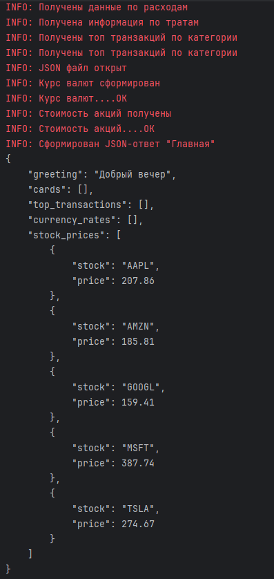
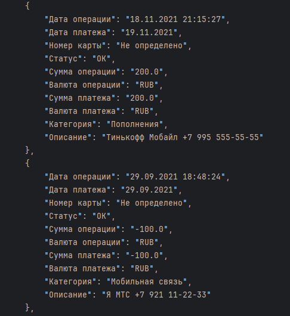
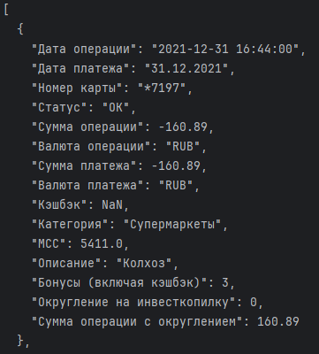
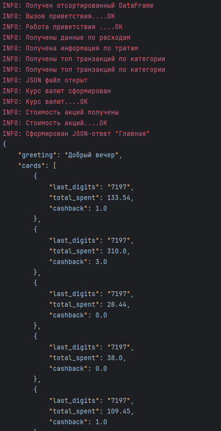

# КУРСОВАЯ РАБОТА №1: Приложение для анализа банковских операций

## **Описание**
Данный проект реализует анализ данных, используя 3 модуля:
1. Главная страница
2. Фильтрация транзакций по номеру телефона
3. Функция фильтрации трат по категориям

### Установка:
Для работы приложения необходимо установить интерпретатор *poetry*:

```pip install --user poetry```

Так же клонируйте репозиторий:

```git clone https://github.com/StreetShiffter/Kurs_82_n1/tree/develop```

### Установка зависимостей:
Для работы проекта воспользуйтесь командами для установок зависимостей:

```poetry add --group dev flake8 black isort mypy requests-mock coverage pytest pandas-stubs types-requests pytest-cov```

Или можно установить все зависимости разом:

```poetry install --with dev```
### Пользование тестирования:
Реализованы тестирующие модули для модулей приложения.

| Основа        | Тесты              |
|---------------|--------------------|
| reports.py    | test_reports.py    |
| services.py   | test_services.py   |
| utils.py      | test_utils.py      |

Для генерации теста:

```pytest "Имя пакета/модуля"```

##### Отчет в HTML:

**Для получения отчетов в формате html, воспользуйтесь командой**
`pytest --cov-report=html`

Для генерации отчета о покрытии:

```pytest --cov```

Для запуска отчета в браузере:
- на ***Windows***: `start htmlcov/index.html`
- на ***macOS***: `open htmlcov/index.html`
- на ***Linux***: `xdg-open htmlcov/index.html`


***Модуль conftest.py используется для данных тестирования функций.***

*Для полной работы установите фреймворк pytest через poetry*

`poetry add --group dev pytest`

### Модули:
1. utils - утилиты для работы основных функций
2. views - модуль работающий с помощью "utils"
    и возвращающую JSON


3. services - модуль работы транзакции, отфильтровывает по номеру и формирует JSON


4. reports - модуль - декоратор для фильтрации транзакций по категории и дате.


5. main - запуск приложения


###### Логирование через logging:
При использовании библиотеки logging, пропишите следующие строки,
для записи в файл:
```
loger_func = logging.getLogger(__name__) # логер к текущему модулю
file_handler = logging.FileHandler('../logs/"имя модуля".log', encoding = 'utf-8')
file_formatter = logging.Formatter('%(asctime)s %(filename)s %(funcName)s %(levelname)s: %(message)s')
file_handler.setFormatter(file_formatter)
loger_func.addHandler(file_handler)
loger_func.setLevel(logging.DEBUG)
```
###### Документация:

Для получения дополнительной информации обратитесь к [документации](README.md)
